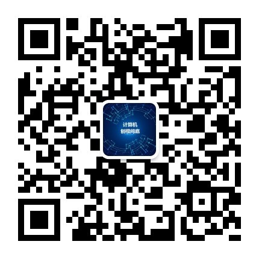
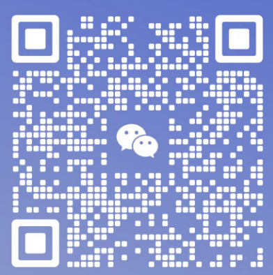

# 计算机科学 电子书以及资料PDF整理以及下载链接

cs是一个收集计算机科学领域经典书籍的开源项目，所有资料大都来着互联网，仅供各位同学免费学习使用，也欢迎各位通信贡献经典书籍，永不收费！

信息时代，网络上充斥着各种资源。给同学们带来选择的同时，也带来了很多干扰。

作为一名互联网/IT从业人员，经常需要搜索一些书籍、资源，在这个过程中踩过很多坑、浪费过很多时间。

为了方便大家，我特意把这些年收集的计算机类书籍共享给大家。

涵盖范围包括但不限于：计算机原理、操作系统、C/C++、Python、Go、Linux、JavaScript、Rust等等。

可以说，你想要的，这里都有！

作者简介：你好，我是无争，本科就读于国内某非985高校，校招时笔试一名拿到头部通信设备厂商offer，曾先后就职于多家头部IT设备公司，
具有多年IT行业工作经验，玩过单片机、做过PCB电路板，焊过电阻电容、二极管，开发过商业操作系统，移植过驱动，贡献过开源，写过服务器端，了解前端。

虽然是科班出身，但相关的知识基本都靠自学，没上过几节课，整天待在主任实验室里做实验，学校图书馆的书被我借了个遍，从网上看视频，找资料。也给一些
非科班出身想转这个行业的朋友、同学建议。

计算机科学是一门实践性很强的学科，需要理论+实践的结合，才能将一个系统工程落地，持续的学习是计算机科学的特点！

希望这个分享能够帮助到你，请帮忙多多star该项目，让更多的人知道和贡献该项目吧。
如果你对升学、职场、工作等内容感兴趣，可以和我进行交流！
最后，欢迎大家关注我的公众号：计算机刨根问底，一个关注计算机原理奥秘的平台！

沟通交流：如果书籍无法下载或是你想要找某一本经典书籍，请添加下方我的个人微信咨询，请备注cs！

